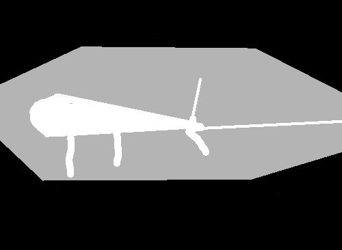

# Počítačové videnie - úloha 3

**Autor: Martin Šváb**

## VOC12 segmentácia

### Vstupné obrázky

Na porovnanie rôznych metód segmentácie sme si vybrali 3 obrázky. V tomto súbore však budeme zobrazovať výstupy len z jedného z nich. Pre kompletné výsledky experimentovania si pozrite obrázky v priečinku output. 

### Pravda

Z každého vstupného obrázku sa snažíme segmentovať červený objekt. Teda upravíme si náš label, tak že z neho vyrobíme masku, kde biely pixel reprezentuje objekt a čierny pixel reprezentuje pozadie. Na nasledujúcom obrázku vidíte hore vstupný obrázok a jeho label. Dole vidíte ako sme tento label upravili na masku a po aplikovaní tejto masky na vstupnom obrázku vidíme vybraný objekt. Tieto masky potom využíme pri všetkých našich experimentov.

### Grabcut

Pre tento experiment sme si pre naše obrázky manuálne vytvorili masku, kde biela farba reprezentuje objekt (foreground), čierna farba reprezentuje pozadie (background) a šedá farba reprezentuje neznámu hodnotu. Túto masku potom upravujeme v iteráciach grabcut algoritmu.

	void grabcut(std::string name, cv::Mat input, cv::Mat mask, cv::Mat truthMask, cv::Mat truth)
	{
		cv::Mat maskGrabcut;
		toGrabcutMask(mask, maskGrabcut);

		cv::Mat foreground, background;
		cv::grabCut(input, maskGrabcut, cv::Rect(), background, foreground, 10, cv::GC_INIT_WITH_MASK);

		cv::Mat maskAfter;
		toDisplayMask(maskGrabcut, maskAfter);

		cv::Mat output;
		applyMask(input, maskAfter, output);

		outputGrabcut(name, input, mask, maskAfter, output, truthMask, truth);
	}

Vypočítané dice skóre: 0.809587

### Superpixely

TBA

	void superpixels(std::string name, cv::Mat input, cv::Mat truthMask, cv::Mat truth)
	{
		cv::Mat blur;
		cv::GaussianBlur(input, blur, cv::Size(5, 5), 0);

		cv::Mat converted;
		cvtColor(blur, converted, cv::COLOR_BGR2Lab);
		
		auto slic = cv::ximgproc::createSuperpixelSLIC(converted, cv::ximgproc::SLIC, 25, 10.0f);
		slic->iterate(50);

		cv::Mat mask;
		slic->getLabelContourMask(mask, false);

		cv::Mat output = input.clone();
		output.setTo(cv::Scalar(0, 0, 255), mask);

		outputSuperpixels(name, input, blur, mask, output, truthMask, truth);
	}

Pri tomto algoritme sme nepočítali dice skóre.

### Floodfill

TBA

	void floodfill(std::string name, cv::Mat input, cv::Mat truthMask, cv::Mat truth)
	{
		cv::Mat gray;
		cv::cvtColor(input, gray, cv::COLOR_BGR2GRAY);

		cv::Mat threshold;
		cv::threshold(gray, threshold, 0, 255, cv::THRESH_BINARY_INV | cv::THRESH_OTSU);

		cv::Mat mask = threshold.clone();
		cv::Point seedPoint(0, 0);
		cv::floodFill(mask, seedPoint, cv::Scalar(255));
		cv::bitwise_not(mask, mask);

		cv::Mat output;
		applyMask(input, mask, output);

		outputFloodfill(name, input, mask, output, truthMask, truth);
	}

Vypočítané dice skóre: 0.0423924

### Threshold

TBA

	void threshold(std::string name, cv::Mat input, cv::Mat truthMask, cv::Mat truth)
	{
		cv::Mat gray;
		cv::cvtColor(input, gray, cv::COLOR_BGR2GRAY);

		cv::Mat mask;
		cv::threshold(gray, mask, 0, 255, cv::THRESH_BINARY_INV | cv::THRESH_OTSU);

		cv::Mat output;
		applyMask(input, mask, output);

		outputThreshold(name, input, mask, output, truthMask, truth);
	}

Vypočítané dice skóre: 0.315691

## Motion tracking

TBA
